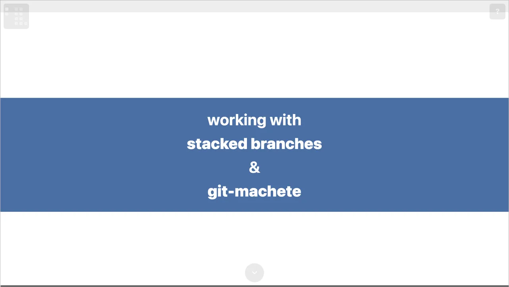

# scrolly

Compile a JSON5 *deck* into a single, self-contained, scrollable
2D-canvas HTML presentation.

*Liked by humans; understood by agents.*



## Why it's different

- **A 2D canvas you fly around**, not a linear reel. Slides sit on an
  integer grid connected by edges; readers zoom out to a deck map and
  zoom into any slide to scroll through it.
- **Scroll-driven keyframe animation.** Element properties (position,
  size, opacity, scale, angle) interpolate as the reader scrolls — no
  timeline, no autoplay.
- **One self-contained HTML file.** A default build inlines every
  asset into a single `index.html` with zero external loads — open it
  by double-clicking, host it anywhere, email it.
- **Agent-friendly.** The CLI exposes full help, input schemas, deck
  introspection, and numbered error codes, so agentic coding tools
  immediately understand how to author and debug scrolly decks.

## Quickstart

```bash
pip install scrolly          # or: uv tool install scrolly
scrolly build examples/stacked-diffs/deck.deck.json --out /tmp/scrolly-out --force
open /tmp/scrolly-out/index.html
```

See [Getting started](getting-started.md) for the guided walkthrough,
or [Concepts](concepts/2d-canvas.md) for the mental model.
