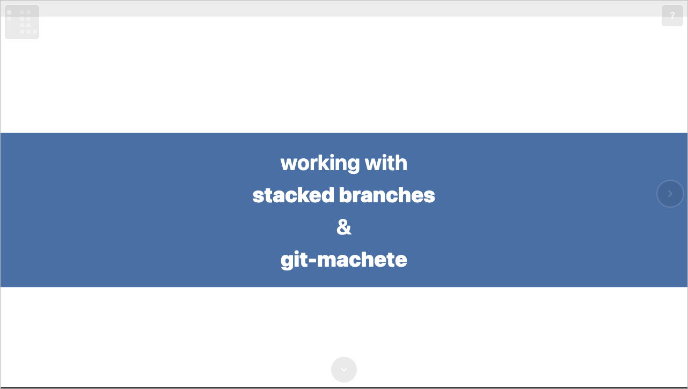

# scrolly

Compile a JSON5 *deck* into a single, self-contained, scrollable
2D-canvas HTML presentation.

*Liked by humans; understood by agents.*



Prefer to drive? The deck below is the **real, interactive build** — not
a screenshot. Scroll inside it to fly around the canvas and animate the
slides.

<div class="live-embed">
  <iframe src="live/hero/index.html" loading="lazy"
          title="Live interactive scrolly deck (stacked-diffs example)"></iframe>
  <noscript>
    Enable JavaScript to explore the live deck — or watch the animation
    above. <a href="live/hero/index.html">Open the full deck ↗</a>
  </noscript>
</div>
<script>
  // A lazy-loaded deck measures its viewport once at init — which, inside an
  // iframe that hasn't resolved its size yet, can be 0×0, leaving the deck
  // collapsed since it never re-measures on its own. Observe the iframe and
  // nudge it with a resize whenever its box resolves to a real size.
  (() => {
    const iframe = document.querySelector(".live-embed iframe");
    if (!iframe) return;
    const nudge = () => { try { iframe.contentWindow.dispatchEvent(new Event("resize")); } catch (e) {} };
    new ResizeObserver(nudge).observe(iframe);
    iframe.addEventListener("load", nudge);
  })();
</script>

<p class="live-embed-actions">
  <a class="md-button md-button--primary" href="live/hero/index.html" target="_blank" rel="noopener">Open full deck ↗</a>
  <a class="md-button" href="https://github.com/bertpl/scrolly/tree/main/examples/stacked-diffs" target="_blank" rel="noopener">View source ↗</a>
</p>

## Why it's different

- **A 2D canvas you fly around**, not a linear reel. Slides sit on an
  integer grid connected by edges; readers zoom out to a deck map and
  zoom into any slide to scroll through it.
- **Scroll-driven keyframe animation.** Element properties (position,
  size, opacity, scale, angle) interpolate as the reader scrolls — no
  timeline, no autoplay.
- **One self-contained HTML file.** A default build inlines every
  asset into a single `index.html` with zero external loads — open it
  by double-clicking, host it anywhere, email it.
- **Agent-friendly.** The CLI exposes full help, input schemas, deck
  introspection, and numbered error codes, so agentic coding tools
  immediately understand how to author and debug scrolly decks.

## Quickstart

```bash
pip install scrolly          # or: uv tool install scrolly
scrolly build examples/stacked-diffs/deck.deck.json --out /tmp/scrolly-out --force
open /tmp/scrolly-out/index.html
```

See [Getting started](getting-started.md) for the guided walkthrough,
or [Concepts](concepts/2d-canvas.md) for the mental model.
