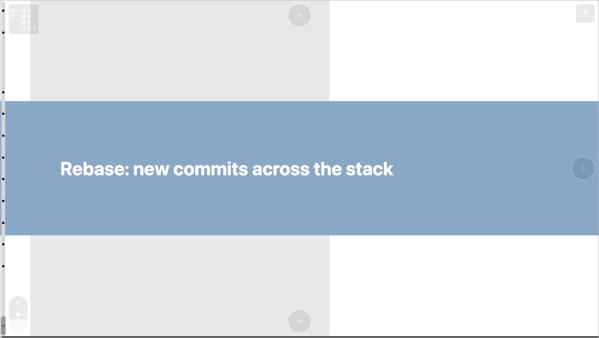

# Debug mode

Debug mode overlays the grid and scroll geometry on a deck, which is
invaluable while authoring — it makes coordinates and snap positions
visible instead of guessed at.

## Toggling it

Press **`d`** to toggle debug mode in either view. A **`D`** indicator
in the bottom-right shows when it's active.

## What it shows

In the **deck map**:

- slide-grid boundary lines, and
- each cell's `(col, row)` coordinate in a label.

In **slide view**:

- grid lines at 10% intervals of the scroll range,
- the numerical value of each snap position, and
- a live scroll-position readout on the scrollbar thumb.

Together these let you line up element positions, confirm snap
placements, and read off the exact scroll values to use in
[animation keyframes](../concepts/animation.md).
