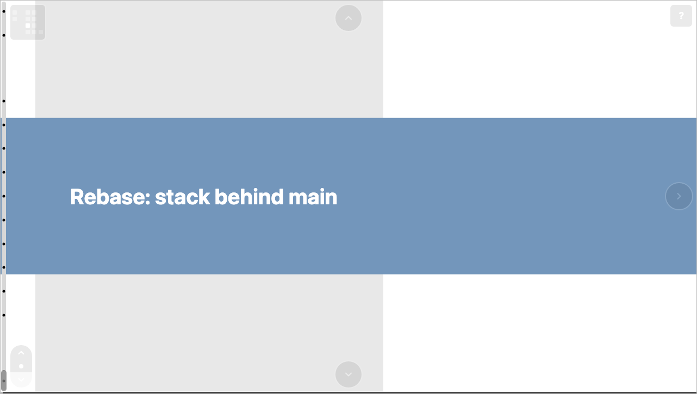

# Deck view & mini-map

A built deck has two zoom levels. **Deck view** (the deck map) is the
zoomed-out overview; **slide view** is a single slide the reader
scrolls through. This page covers the map and the control used to
return to it.

## Deck view

Deck view shows every slide at its grid position, the edges between
them, and any group tabs — the whole presentation at a glance. It
centers on the occupied region of the grid, so decks whose slides don't
start at the origin still sit centered rather than off to one side.

Click any slide to zoom in; press **`z`** to toggle back out (see
[Navigation & shortcuts](navigation.md)).

## The mini-map

From within a slide, the zoom-out control is a small **mini-map**: a
compact grid with a cell for each slide at its `(col, row)` position
and the current slide highlighted. It gives a sense of where you are in
the deck and returns you to the full map on click.

The mini-map scales to fit decks of different sizes. For a simpler
single-icon control instead, build with `--simplified-zoom-control`
(see the [CLI reference](../reference/cli.md)).

## Idle fade

The scrollbar, snap control, and navigation chrome fade out after a
short period of inactivity to keep the view clean, and return on
interaction.
