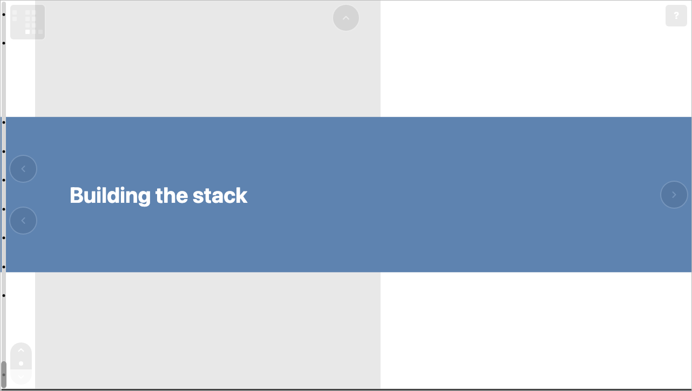
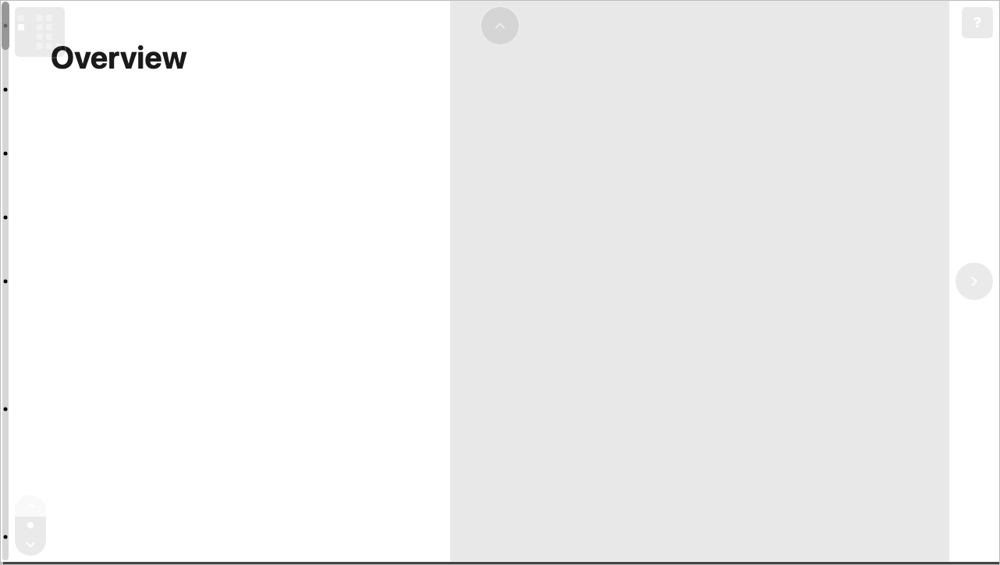

# Navigation & shortcuts

A built deck is interactive. This section documents the reader-side
experience — how to move around a finished presentation in the browser.
None of it requires authoring knowledge; it's what your audience does.

## Moving between slides

- **Arrow keys** move between grid-neighboring slides along the deck's
  edges.
- **Clicking a slide** in the deck map zooms into it.
- **Navigation arrows** appear at a slide's edges in slide view,
  pointing to its neighbors.

## Scrolling a slide

- **Mouse wheel / trackpad** scrolls the current slide, driving its
  animation.
- **Shift + arrow keys** scroll without leaving the slide.
- The **scrollbar** shows progress; when a slide has snap positions,
  the view eases to them as you scroll.

## Switching views

- **`z`** toggles between the deck map and the current slide.

See [Deck view & mini-map](deck-view-and-mini-map.md) for the
zoomed-out map and its mini-map control.

## Snapping

- **`s`** toggles scroll snapping on or off, and brings the scrollbar
  and snap control back into view so the change is visible.

## At a glance

| Key | Action |
| --- | --- |
| Arrow keys | Move between slides |
| Shift + arrows | Scroll the current slide |
| `z` | Toggle deck map / slide view |
| `s` | Toggle scroll snapping |
| `h` or `?` | Open the [help screen](help-screen.md) |
| `d` | Toggle [debug mode](debug-mode.md) |

The help screen lists these shortcuts inside any deck, so readers never
need to leave the presentation to find them.
